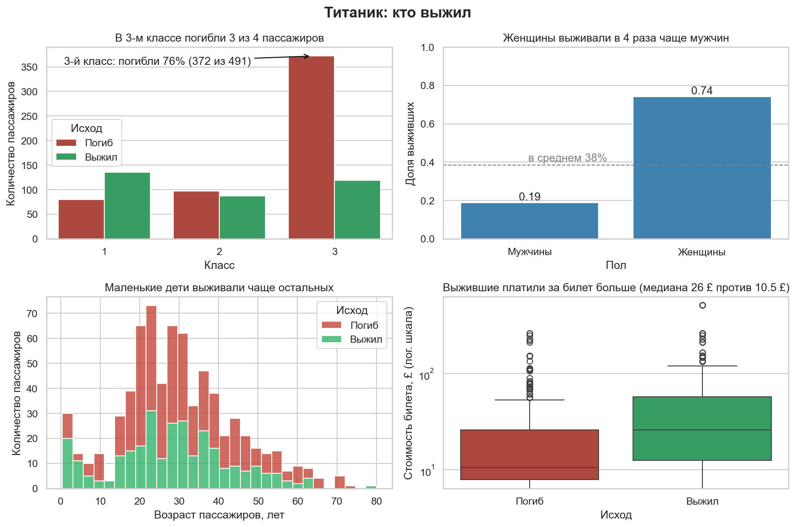
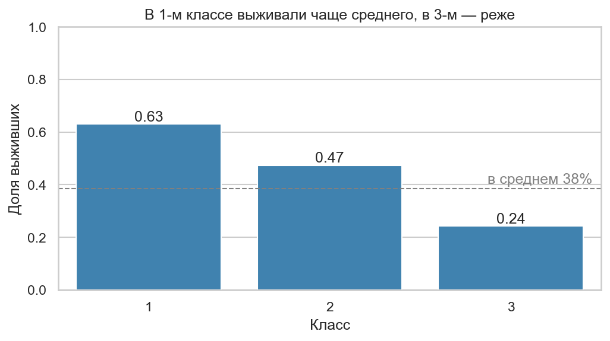
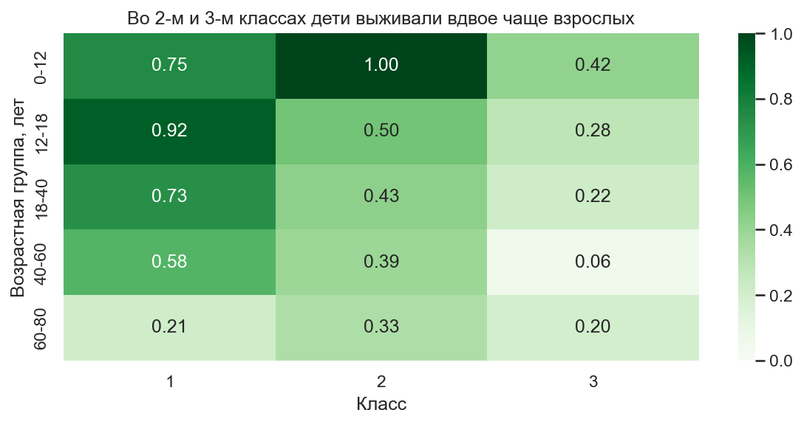
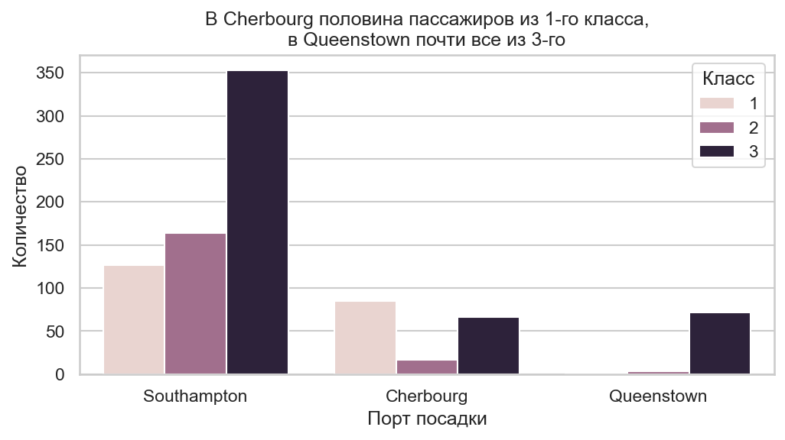
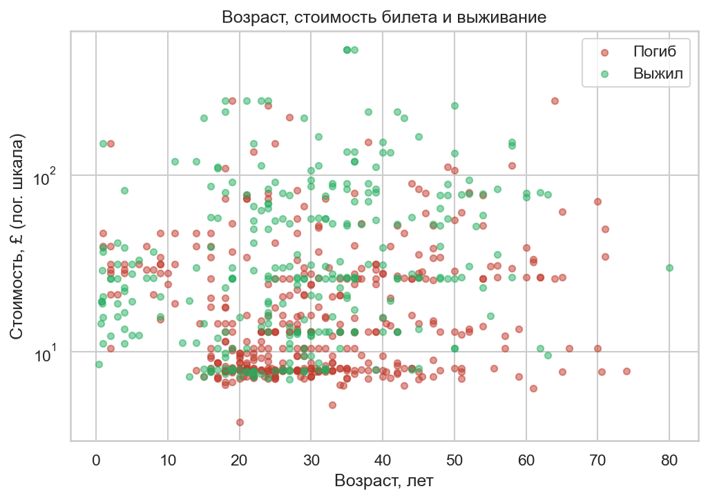

# Титаник: кто выжил и почему

Разведочный анализ данных (EDA) о пассажирах «Титаника»: 891 человек,
данные [Kaggle Titanic](https://www.kaggle.com/c/titanic/data).
Цель — найти, какие признаки связаны с выживанием.



## Главные выводы

1. **Пол — самый сильный фактор.** Женщины выживали в 4 раза чаще мужчин (74% против 19%).
2. **Класс.** В 1-м классе выжили 63% пассажиров, в 3-м — только 24%: там погибли 372 человека из 491.
3. **Дети.** Во 2-м и 3-м классах дети до 12 лет выживали примерно вдвое чаще взрослых 18–40 лет.
4. **Цена билета.** Выжившие платили больше: медиана £26 против £10.5 у погибших.
5. **Порт посадки связан с выживанием через класс.** В Cherbourg половина пассажиров ехала 1-м классом, поэтому там самые дорогие билеты; в Queenstown 94% пассажиров были из 3-го класса.

## Подробнее

### Класс


Средняя доля выживших — 38%. 1-й класс заметно выше среднего (63%), 2-й — около среднего (47%), 3-й — заметно ниже (24%).

### Возраст и класс вместе


Во 2-м классе выжили все 17 детей до 12 лет (против 43% у взрослых 18–40), в 3-м — 42% детей против 22% взрослых.
В 1-м классе разница не видна: детей там всего 4, и по ним долю не оценить.

### Порт посадки


Медианная цена билета: Cherbourg — £29.7, Southampton — £13.0, Queenstown — £7.75.
Порт сам по себе не делает билет дорогим: за ним стоит состав пассажиров по классам.

### Возраст, цена билета и выживание


Среди дорогих билетов заметно больше выживших (зелёные точки), среди дешёвых (£7–10) — погибших.
Связь с возрастом на этом графике почти не видна: она проявляется только у детей и только внутри классов (см. тепловую карту выше).

## Ограничения

- Возраст неизвестен у 177 из 891 пассажиров (20%); на графиках по возрасту они не учтены.
- 15 пассажиров с ценой билета 0 не видны на логарифмической шкале.
- Выводы о группах меньше ~10 человек ненадёжны: например, на тепловой карте клетка «60–80 лет, 2-й класс» посчитана по 3 людям, «0–12 лет, 1-й класс» — по 4.
- Это корреляции, а не причины: например, класс, цена билета и порт сильно связаны между собой, и по этим графикам нельзя разделить их влияние.

## Как запустить

```bash
pip install -r requirements.txt
python src/make_figures.py
```

Картинки сохраняются в папку `figures/`.

## Стек

Python, pandas, Matplotlib, Seaborn